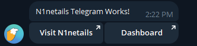
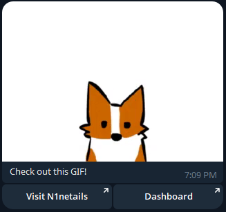
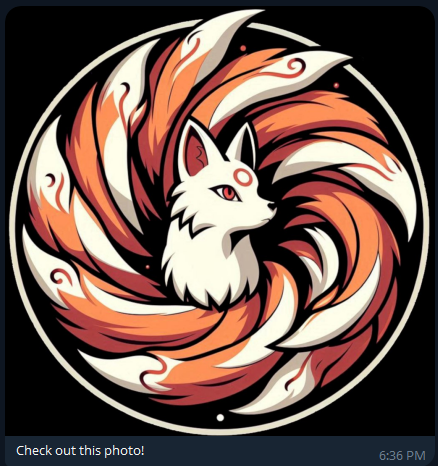
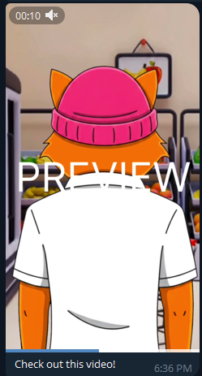
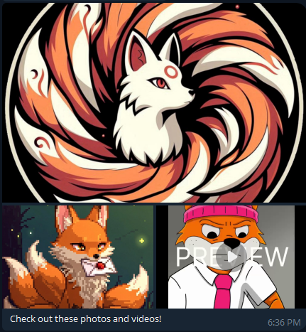

# N1netails

<div align="center">
  
</div>

[](LICENSE)


# Telegram Client
N1netails is an open-source project that provides practical alerts and monitoring for applications.
Use the N1netails Telegram Client to easily send messages to a telegram chat group.

## How to set up telegram
Telegram is an application you can download on your smartphone. You can download Telegram here
https://telegram.org/

** Note: Telegram needs to be set up on your smartphone before you can use it on your desktop. **

### How to create a telegram bot

To send messages using the N1ne Tails Telegram Client, you need to create a Telegram bot and retrieve its **bot token**. Follow these steps:

#### 1. Start a chat with [@BotFather](https://t.me/BotFather)

[@BotFather](https://t.me/BotFather) is the official Telegram bot for creating and managing other bots.

#### 2. Create a new bot

Send the following command to BotFather:

```
/newbot
```

You will be prompted to:

* **Name your bot** (this can be anything, like `N1neTailsBot`)
* **Choose a username** (this must end with `bot`, e.g. `n1netails_alertbot`)

#### 3. Get your bot token

After creating your bot, BotFather will send you an HTTP API token that looks like this:

```
123456789:ABCdefGhIJKlmNoPQRstuVWXyz
```

> 📌 **Important:** Keep this token secure. Anyone with access can control your bot.

#### 4. Add the bot to a chat or group

* Create or open an existing Telegram **group chat**.
* Add your bot to the group like you would any other user.
* Ensure the bot has permission to **send messages** in the group.

#### 5. Get the chat ID

To send messages to a group or individual chat, you’ll need the chat ID. Here are two common methods:

**Option A: Use a third-party bot like [@getidsbot](https://t.me/getidsbot)**

* Add `@getidsbot` to your group or start a direct chat.
* It will reply with the chat ID.

**Option B: Use the Telegram Bot API**
Send a request to the `getUpdates` endpoint using your bot token:

```bash
curl https://api.telegram.org/bot<YOUR_BOT_TOKEN>/getUpdates
```

Look for `"chat":{"id":...}` in the response.

---

You can now use the **bot token** and **chat ID** in your Java code to send alerts with the `n1netails-telegram-client`.

---


Resources: 
- https://core.telegram.org/
- https://core.telegram.org/methods

## Install
Install the telegram client by adding the following dependency:
```xml
<dependency>
    <groupId>com.n1netails</groupId>
    <artifactId>n1netails-telegram-client</artifactId>
    <version>0.4.0</version>
</dependency>
```

Gradle (Groovy)
```groovy
implementation 'com.n1netails:n1netails-telegram-client:0.4.0'
```

## Configure
Here is how you can configure the project for different frameworks

### Spring Boot
Add the following beans to your spring boot application:

```java
import com.n1netails.n1netails.telegram.api.TelegramClient;
import com.n1netails.n1netails.telegram.internal.TelegramClientImpl;
import com.n1netails.n1netails.telegram.service.BotService;
import org.springframework.context.annotation.Bean;
import org.springframework.context.annotation.Configuration;

@Configuration
public class TelegramConfig {

    @Bean
    public BotService botService() { 
        return new BotService(); 
    }

    @Bean
    public TelegramClient telegramClient(BotService service) {
        return new TelegramClientImpl(service);
    }
}
```

### Java

```java
import com.n1netails.n1netails.telegram.internal.TelegramClientImpl;
import com.n1netails.n1netails.telegram.service.BotService;

BotService service = new BotService();
TelegramClient client = new TelegramClientImpl(service);
```

## Use
```java
import com.n1netails.n1netails.telegram.api.TelegramClient;
import com.n1netails.n1netails.telegram.internal.TelegramClientImpl;
import com.n1netails.n1netails.telegram.model.Button;
import com.n1netails.n1netails.telegram.model.InlineKeyboardMarkup;
import com.n1netails.n1netails.telegram.model.TelegramMessage;
import com.n1netails.n1netails.telegram.service.BotService;

import java.util.Arrays;
import java.util.Collections;

public class ExampleService {
    private final TelegramClient telegramClient;

    public ExampleService() {
        this.telegramClient = new TelegramClientImpl(new BotService());
    }

    public void telegramNotificationExample(String content) throws TelegramClientException {
        Button button = new Button("Visit N1netails", "https://n1netails.com");
        InlineKeyboardMarkup keyboardMarkup = new InlineKeyboardMarkup(Collections.singletonList(Collections.singletonList(button)));
        TelegramMessage telegramMessage = new TelegramMessage("N1netails Telegram Works!", false, keyboardMarkup);
        // replace with your telegram chat id
        String chatId = "your-telegram-chat-id";
        // replace with your telegram bot token
        String botToken = "your-telegram-bot-token";
        telegramClient.sendMessage(chatId, botToken, telegramMessage);
    }

    public void telegramGifNotificationExample() throws TelegramClientException {
        TelegramMessage telegramMessage = new TelegramMessage("Check out this GIF!", "https://media1.giphy.com/media/v1.Y2lkPTc5MGI3NjExaDRhOWtpMnVsM2NiMzJ4aXpoOXpuamZzcHpudG4zbzIzenVlaHN0eSZlcD12MV9pbnRlcm5hbF9naWZfYnlfaWQmY3Q9Zw/xsE65jaPsUKUo/giphy.gif", false);
        // replace with your telegram chat id
        String chatId = "your-telegram-chat-id";
        // replace with your telegram bot token
        String botToken = "your-telegram-bot-token";
        telegramClient.sendMessage(chatId, botToken, telegramMessage);
    }

    public void telegramGifNotificationWithCtaButtonsExample() throws TelegramClientException {
        Button button = new Button("Visit N1netails", "https://n1netails.com");
        InlineKeyboardMarkup keyboardMarkup = new InlineKeyboardMarkup(Collections.singletonList(Collections.singletonList(button)));
        TelegramMessage telegramMessage = new TelegramMessage("Check out this GIF!", "https://media1.giphy.com/media/v1.Y2lkPTc5MGI3NjExaDRhOWtpMnVsM2NiMzJ4aXpoOXpuamZzcHpudG4zbzIzenVlaHN0eSZlcD12MV9pbnRlcm5hbF9naWZfYnlfaWQmY3Q9Zw/xsE65jaPsUKUo/giphy.gif", false, keyboardMarkup);
        // replace with your telegram chat id
        String chatId = "your-telegram-chat-id";
        // replace with your telegram bot token
        String botToken = "your-telegram-bot-token";
        telegramClient.sendMessage(chatId, botToken, telegramMessage);
    }

    public void telegramImageNotificationExample() throws TelegramClientException {
        TelegramMessage telegramMessage = new TelegramMessage();
        telegramMessage.setText("Check out this photo!");
        telegramMessage.setImages(Collections.singletonList("https://n1netails.com/img/n1netails_icon_transparent.png"));
        // replace with your telegram chat id
        String chatId = "your-telegram-chat-id";
        // replace with your telegram bot token
        String botToken = "your-telegram-bot-token";
        telegramClient.sendMessage(chatId, botToken, telegramMessage);
    }

    public void telegramVideoNotificationExample() throws TelegramClientException {
        TelegramMessage telegramMessage = new TelegramMessage();
        telegramMessage.setText("Check out this video!");
        telegramMessage.setVideos(Collections.singletonList("https://n1netails.nyc3.cdn.digitaloceanspaces.com/video_2026-02-11_18-16-07.mp4"));
        // replace with your telegram chat id
        String chatId = "your-telegram-chat-id";
        // replace with your telegram bot token
        String botToken = "your-telegram-bot-token";
        telegramClient.sendMessage(chatId, botToken, telegramMessage);
    }

    public void telegramMediaGroupNotificationExample() throws TelegramClientException {
        TelegramMessage telegramMessage = new TelegramMessage();
        telegramMessage.setText("Check out these photos and videos!");
        telegramMessage.setImages(Arrays.asList("https://n1netails.com/img/n1netails_icon_transparent.png", "https://n1netails.com/img/quickstart/n1netails-letter.jpg"));
        telegramMessage.setVideos(Collections.singletonList("https://n1netails.nyc3.cdn.digitaloceanspaces.com/video_2026-02-11_18-16-07.mp4"));
        // replace with your telegram chat id
        String chatId = "your-telegram-chat-id";
        // replace with your telegram bot token
        String botToken = "your-telegram-bot-token";
        telegramClient.sendMessage(chatId, botToken, telegramMessage);
    }
}
```

> 📌 **Note:** Media (images, videos, animations) must be provided as public URLs. Telegram does not support `replyMarkup` (CTA buttons) when sending multiple media items (Media Group).

#### Example message output
<div align="center">
  
</div>

#### Example message GIF output
<div align="center">
  
</div>

#### Example message GIF with CTA Buttons output
<div align="center">
  
</div>

#### Example message Image output
<div align="center">
  
</div>

#### Example message Video output
<div align="center">
  
</div>

#### Example message Media group output
<div align="center">
  
</div>


# Develop
## Build
Build the project using the following command
```bash
mvn clean install
```

## Maven Central Repository
Use the following doc to get setup with publishing to the maven central repository
https://central.sonatype.org/register/central-portal/#publishing

Maven install using release profile.
```bash
mvn clean install -P release
```

Maven deploy to the maven central repository
```bash
mvn deploy -P release
```

### GPG
Generate keys
```bash
gpg --full-generate-key
```

List keys
```bash
gpg --list-secret-keys --keyid-format LONG
```

Export
### Export private key
```bash
gpg --export-secret-keys --armor YOUR_KEY_ID > private.asc
```

### Export public key

```bash
gpg --export --armor YOUR_KEY_ID > public.asc
```

Import
```bash
gpg --import private.asc
gpg --import public.asc
```

List packets (good for validating keys were exported correctly)
```bash
gpg --list-packets public.asc
```


## Support

For community users, open an issue on GitHub or Join our Discord

[](https://discord.gg/ma9CCw7F2x)

## Contributing

Please use the following guidelines for contributions [CONTRIBUTING](./contributing.md)

## N1netails Telegram Client Contributors

Thanks to all the amazing people who contributed to N1netails Telegram Client! 💙

[](https://github.com/n1netails/n1netails-telegram-client/graphs/contributors)